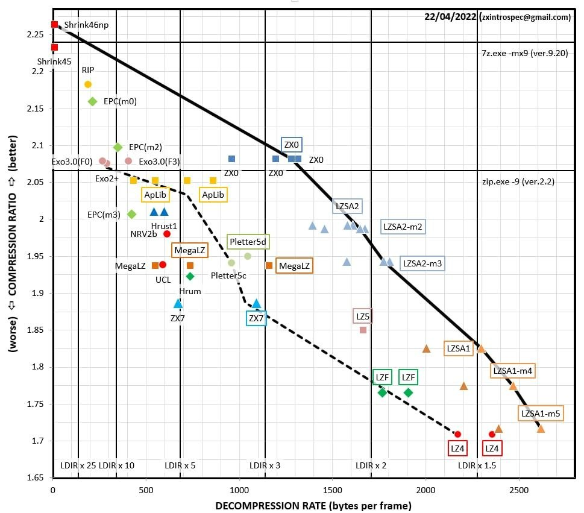

# Compressors-JS

Pure JavaScript implementations of compression algorithms commonly used on retro platforms (ZX Spectrum, DOS, ARM, Z80, 6502 and others). Each implementation works in both browser and Node.js with no external dependencies.

> **Licensing:** each compressor is a port of a different original work and carries its **own license** (BSD-3-Clause, MIT, zlib, Unlicense, the Shrinkler license, Exomizer's non-commercial terms, etc.). There is no single project-wide license — check the `LICENSE` file in each compressor's directory individually before use, especially for commercial purposes (e.g. Exomizer's compressor is non-commercial). The per-compressor license is listed in the table below.

## Compressors

| Compressor | Algorithm | Original Author | License |
|------------|-----------|-----------------|---------|
| [zx7](zx7-js/) | Optimal LZ77/LZSS | Einar Saukas | BSD-3-Clause |
| [zx0](zx0-js/) | Optimal LZ77/LZSS (improved successor to ZX7) | Einar Saukas | BSD-3-Clause |
| [lc](lc-js/) | Optimal LZH (Laser Compact 5.2.1) | Hrumer, Nikita Burnashev, Eugene Larchenko | BSD-3-Clause |
| [exomizer 2](exomizer2-js/) | Optimal LZ77 with adaptive encoding tables | Magnus Lind | Non-commercial / zlib |
| [upkr](upkr-js/) | LZ with rANS entropy coding | exoticorn (Dennis Ranke) | Unlicense |
| [lgk](lgk-js/) | Tile-based XOR prediction + Huffman (LgK v1.1rs) | Lethargeek | BSD-3-Clause |
| [shrinkler](shrinkler-js/) | LZ77 with range coding and adaptive contexts | Aske Simon Christensen | Shrinkler (permissive) |
| [aplib](aplib-js/) | LZ77 with modified Elias gamma coding | Jørgen Ibsen, Emmanuel Marty | zlib |
| [lzsa2](lzsa2-js/) | LZ77 with byte-aligned nibble encoding | Emmanuel Marty | zlib |
| [hrust](hrust-js/) | LZ77 with 16-bit MSB-first control word bitstream | Dmitry Pyankov, Eugene Larchenko | MIT |
| [rip](rip-js/) | LZ77 with canonical Huffman coding (RIP 0.2x + mRIP) | Roman Petrov (Mesur'a) | BSD-3-Clause |
| [bitbuster](bitbuster-js/) | LZ77 with Elias gamma coding (BitBuster 1.2 + 2) | Arjan Bakker (Team Bomba) | MIT |
| [rcs](rcs-js/) | ZX Spectrum screen reorder transform (pairs with ZX0/ZX7) | Einar Saukas | BSD-3-Clause |

## Overview

### ZX7

Optimal LZ77/LZSS compressor by Einar Saukas. Generates perfectly optimal encoding with a maximum back-reference distance of 2176 bytes. Supports forward and backward compression, prefix/suffix referencing, and delta calculation for in-place decompression.

- Original: https://spectrumcomputing.co.uk/entry/27996/ZX-Spectrum/ZX7
- Implementation: https://github.com/antoniovillena/zx7b

### ZX0

Successor to ZX7, also by Einar Saukas. Achieves better compression ratios with a larger maximum offset of 32,640 bytes. Supports V1 (classic) and V2 (default) formats, backward compression, quick mode, and prefix/suffix referencing. Fully compatible with files compressed by the original zx0.exe/dzx0.exe tools.

- Original: https://github.com/einar-saukas/ZX0

### Laser Compact (LC)

Optimal LZH compressor originally designed for the ZX Spectrum, developed by Hrumer (1994-1999, 2014), with a PC version by Nikita Burnashev (2005) and improvements by Eugene Larchenko. Features ZX Spectrum screen-specific compression with pixel reordering. Supports the LCMP5 file format compatible with the original laser.exe tool.

### Exomizer 2

Optimal LZ77 compressor by Magnus Lind with Huffman-like adaptive encoding tables, widely used on retro platforms (C64, ZX Spectrum, Amiga, etc.). Features multi-pass encoding table optimization for best compression ratios, three separate offset tables for different match lengths, gamma-coded length encoding, literal sequence escaping for incompressible regions, and forward/backward compression modes.

- Original: https://bitbucket.org/magli143/exomizer/

### UPKR

General-purpose LZ compressor with rANS (Asymmetric Numeral Systems) entropy coding by exoticorn (Dennis Ranke). Initially designed for the MicroW8 fantasy console. Achieves compression ratios competitive with Shrinkler while keeping decompression code extremely small. Supports compression levels 0-9, configurable format variants for retro platform decompressors (Z80, x86, ARM), bitstream mode, and parity contexts.

- Original: https://github.com/exoticorn/upkr

### LgK

ZX Spectrum screen image compressor by Lethargeek (LgK v1.1rs, Row-Sequence edition). Uses tile-based XOR prediction with exhaustive parameter search, Huffman coding for mode selection, and attribute RLE with palette optimization. Supports interleaved (mixed) attribute packing for progressive on-screen display, partial screen compression (row ranges), and optional attribute optimization via ink/paper swap.

### Shrinkler

LZ77 compressor with range coding and adaptive probability contexts by Aske Simon Christensen (Blueberry / Loonies). Originally designed for Amiga executables, Shrinkler achieves excellent compression ratios through multi-pass optimal parsing with frequency-based cost estimation. Features compression levels 1-9, repeated offset optimization, interleaved Elias gamma coding for offsets and lengths, and optional parity contexts for structured data.

- Original: https://github.com/askeksa/Shrinkler

### aPLib

LZ77 compressor with modified Elias gamma coding by Jørgen Ibsen, with format reimplemented following apultra by Emmanuel Marty. Uses four token types (literals, large matches, 7-bit short matches, 4-bit micro matches) with optimal parsing via forward dynamic programming and multi-arrival tracking. Features SA-IS suffix array match finding, repeated offset optimization, and compression levels 1-9.

- Original: https://ibsensoftware.com/products_aPLib.html
- apultra: https://github.com/emmanuel-marty/apultra

### LZSA2

LZ77 compressor with byte-aligned nibble encoding by Emmanuel Marty. Uses five offset encoding modes (5/9/13/16-bit + repeated offset) with optimal parsing via forward dynamic programming and multi-arrival tracking. Features SA-IS suffix array match finding, nibble-packed variable-length encoding, and compression levels 1-9. Compatible with the original `lzsa` tool and all platform depackers (Z80, 6502, 8088, 68000).

- Original: https://github.com/emmanuel-marty/lzsa

### Hrust

LZ77 compressor with 16-bit MSB-first control word bitstream (Hrust 1.3) by Dmitry Pyankov, reimplemented following OHC (Optimal Hrust Compressor) by Eugene Larchenko. Uses backward DP optimal parsing with a variable D register (2-8) controlling the extended match window. Features six token types (single literal, count=1/2/3+ matches, RIR, multi-literal), pair-encoded match counts, and interleaved control words with raw data bytes. Compatible with standard Z80 depackers (dehrust).

- OHC reference: https://github.com/specke/ohc

### RIP

LZ77 compressor with canonical Huffman coding (RIP 0.2x) by Roman Petrov (Mesur'a). Uses a 3-level tree structure: a pre-tree (18 symbols, 4-bit nibbles) encodes the main tree (288 symbols for literals, end marker, and match lengths) and distance tree (32 symbols). Match lengths and distances use LLEN variable-length encoding with extra bits. Supports both RIP (with repeat-last-offset) and mRIP (modified, no offset reuse) formats. Compression levels 1-9, with optimal DP parsing at levels 7-9.

- Z80 depackers: [uniabis/z80depacker](https://github.com/uniabis/z80depacker) (228/218 bytes)

### BitBuster

LZ77 compressor with Elias gamma coding (BitBuster 1.2 + BitBuster 2) by Arjan Bakker (Team Bomba). Designed for MSX and other Z80 platforms with a compact 11-bit offset window (max 2048 bytes). Uses MSB-first bitstream with interleaved literal bytes, 7-bit short and 11-bit long offset encoding, and Elias gamma coded match lengths. BitBuster 1.2 uses a single compressed stream with a 4-byte original-length header; BitBuster 2 uses independently compressed blocks with a block-count header. Compression levels 1-9, with optimal DP parsing at levels 7-9.

- BitBuster 1.2: [abekermsx/BitBuster-1.2](https://github.com/abekermsx/BitBuster-1.2)
- BitBuster 2: [abekermsx/Bitbuster-2](https://github.com/abekermsx/Bitbuster-2)

### RCS

Re-ordered Compressed Screen transform by Einar Saukas. RCS is **not a compressor itself** — it rearranges the 6144 bitmap bytes of a ZX Spectrum `SCR` screen (the 768 attribute bytes are left unchanged) into S→C→R→L order, exposing longer matches so the screen compresses roughly **10% smaller** with ZX0 or ZX7. RCS defines no file format or header; the reordered 6912-byte buffer is simply fed to a standard ZX0/ZX7 compressor. On Z80, the "smart" depackers (`dzx0_smartRCS` / `dzx7_smartRCS`) fuse decompression with the un-reorder in a single pass. This port pairs RCS with the `zx0-js`/`zx7-js` codecs (forward and backwards) and is roundtrip-verifiable in JavaScript. Transform ported from the SpectraLab project.

- Original: https://github.com/einar-saukas/RCS

## Common Features

All implementations share these characteristics:

- Pure JavaScript, no build step or transpilation required
- Work in browser (via `<script>` tag) and Node.js (via `require`)
- No third-party dependencies (the `rcs` module builds on the bundled `zx0`/`zx7` codecs — load or `require` those alongside it)
- Uint8Array-based binary I/O
- Interactive HTML test interface for each compressor

## Comparison tool

`compressors_compare.html` benchmarks every compressor on a file you load: compressed
size, ratio, estimated Z80 depacker size, and total cost, with an automatic
JavaScript compress→decompress roundtrip check.


 For ZX Spectrum screens (6912 bytes)
it also enables the screen-only methods (LC screen, LgK, RCS+ZX0/ZX7) and can export a
ready-to-assemble Z80 depacker `.asm` (sjasmplus, with ZX-M8XXX `@main`/`@entry`
directives) for any method.

## Testing

`tests/` contains an end-to-end regression harness that verifies the **real Z80
depackers** correctly decode what the **JS packers** emit — not just a JS-to-JS
roundtrip. For every test screen and each compressor with a Z80 depacker it packs in
JS, assembles the depacker with [ZX-M8XXX](https://github.com/Bedazzle/ZX-M8XXX)'s
`sjasmplus-js`, runs it on ZX-M8XXX's Z80 core, and byte-compares the decompressed
`$4000–$5AFF` to the original.

```sh
python tests/run_depacker_roundtrip.py
```

See [tests/README.md](tests/README.md) for prerequisites and configuration. (This
harness caught a real input-dependent bug in the LgK packer that JS-only roundtrip
testing missed.)

## JavaScript ports by Bedazzle - 2026
